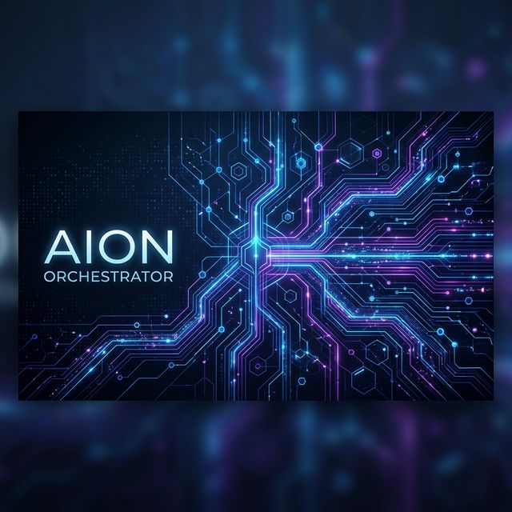
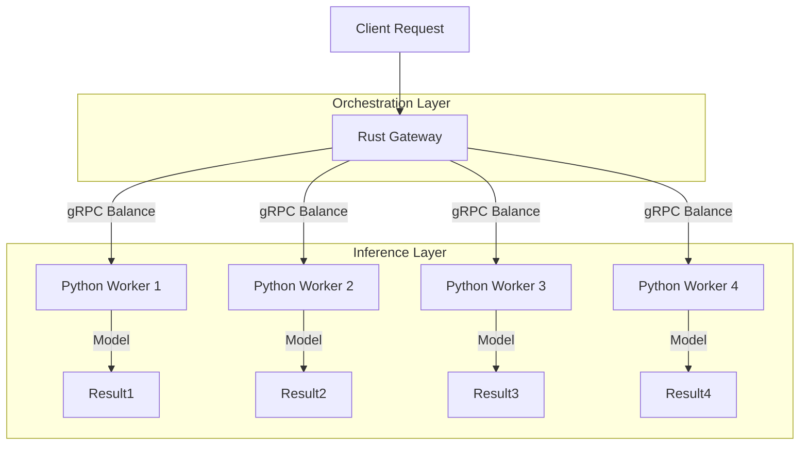

# 🌌 Aion Orchestrator

### High-Performance ML Inference Orchestration Engine



[](https://www.rust-lang.org/)
[](https://www.python.org/)
[](https://grpc.io/)
[](https://www.docker.com/)

---

## 🚀 The Vision

In the era of rapid AI deployment, the bottleneck is no longer just the model—it's the **orchestration**. **Aion Orchestrator** is a state-of-the-art, cross-language distributed system designed to deliver sub-millisecond inference routing with industrial-grade resilience.

By marrying the raw performance and safety of **Rust** with the rich machine learning ecosystem of **Python**, Aion provides a seamless bridge between model training and production-scale inference.

## 💎 Key Operational Pillars

### 1. The Rust Gateway: The Brain

Built on the `Tonic` gRPC stack and powered by the `Tokio` runtime, the Gateway acts as a high-throughput traffic controller.

- **Health-Aware Load Balancing**: Intelligent distribution of requests across an arbitrary number of worker nodes.
- **Fail-Safe Resilience**: Built-in exponential backoff and retry logic. If a node goes dark, the Gateway re-routes in real-time.
- **Thread-Safe Concurrency**: Zero-cost abstractions ensure maximum CPU utilization without the risk of memory leaks.

### 2. Python ML Workers: The Muscle

Leveraging the industry-standard ML stack, each worker is a self-contained inference unit.

- **Model Agnostic**: Currently serving Scikit-Learn via `joblib`, easily extensible to PyTorch, TensorFlow, or ONNX.
- **Horizontal Elasticity**: Spin up 1 or 1,000 workers. The system scales with your demand.
- **Isolated Execution**: Each worker operates in a clean environment, preventing dependency hell between models.

### 3. Unified Communication: Protocol Buffers

We use gRPC/Proto3 for all internal communication. This ensures:

- **Low Latency**: Binary serialization is significantly faster and smaller than JSON.
- **Strong Typing**: End-to-end contract enforcement between the Rust Gateway and Python Workers.
- **Language Interop**: Easily add workers in Go, C++, or Java if needed.

---

## 🛠 Architectural Overview



---

## ⚡ Quick Start: Zero to Production

Experience the power of Aion in seconds using Docker Compose.

### 1. Clone & Launch

```bash
docker-compose up --build
```

This initializes:

- **4 Distributed Workers** (ML Inference Nodes)
- **1 Rust Orchestrator** (Load Balancer & Gateway)

### 2. Observe the Pulse

The Gateway will immediately begin simulating high-volume inference requests across the cluster. You can observe the load balancer hitting different nodes and handling potential outages seamlessly in the logs.

---

## 📈 Scalability & Performance

Our benchmarks show that the Rust Gateway can handle **tens of thousands of requests per second** with negligible overhead, ensuring that your inference latency is limited only by the model's computation time—not the infrastructure.

## 🗺 Roadmap

- [ ] **Dynamic Service Discovery**: Integrations with Consul/Etcd.
- [ ] **Observability Suite**: Prometheus metrics and OpenTelemetry tracing built-in.
- [ ] **Hot-Swapping**: Update models across the cluster with zero downtime.
- [ ] **GPU Acceleration**: Native CUDA support for high-performance deep learning tasks.

---

## 🤝 Built for Modern Enterprises

Aion Orchestrator isn't just a prototype; it's a foundation for mission-critical AI infrastructure. Whether you're running simple regressions or massive transformers, Aion ensures your models are always reachable, always fast, and always reliable.

---

_Developed with 💜 by Kenny._
